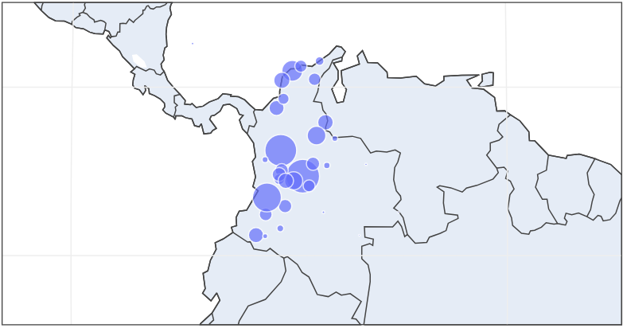
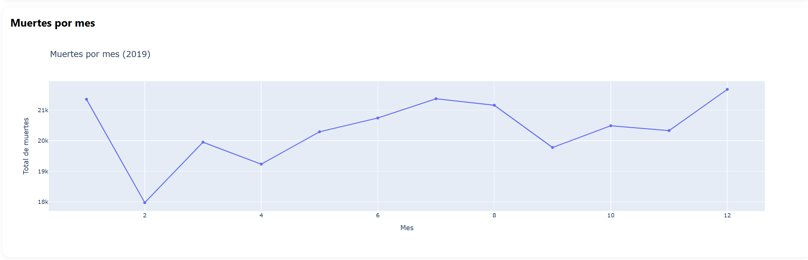
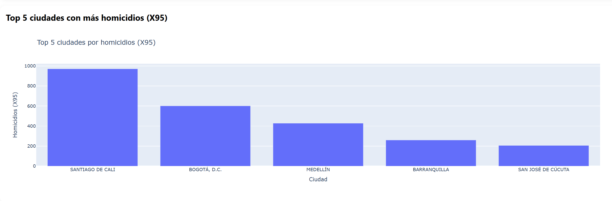
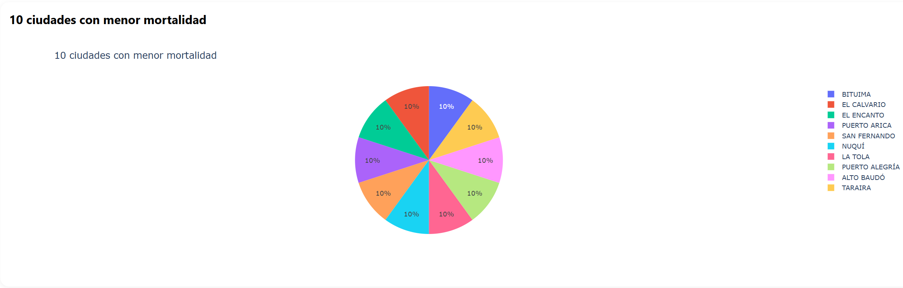
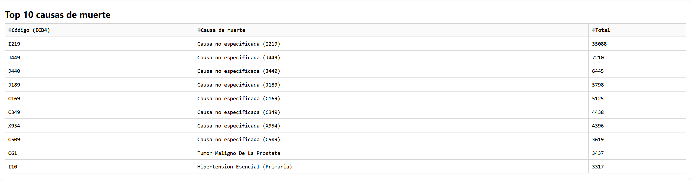
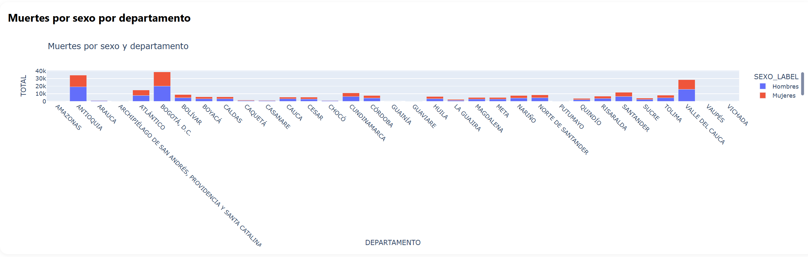
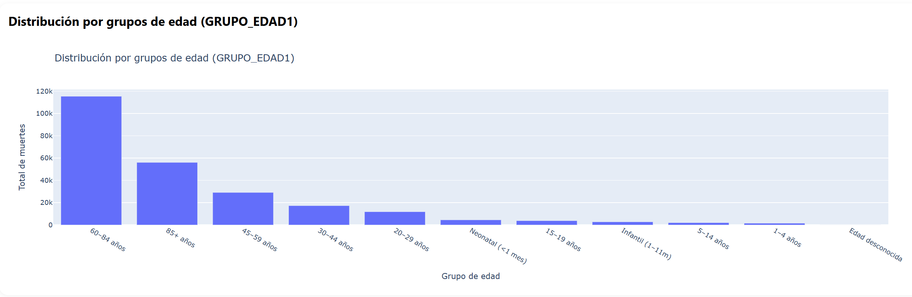

# Dashboard de Mortalidad en Colombia (2019) — Dash + Plotly

Autor: Luis Andres Rodriguez Carrillo  
Fuente de datos: DANE — Estadísticas Vitales (EEVV) 2019 (No fetal).

## Introducción
Esta aplicación web interactiva permite explorar la mortalidad en Colombia para el año 2019, utilizando los microdatos de defunciones no fetales. Provee visualizaciones que facilitan la interpretación de patrones demográficos y regionales de mortalidad.

## Objetivo
Construir un dashboard interactivo que integre:
- Mapa (centroides departamentales) con la distribución total de muertes.
- Serie temporal del total mensual de muertes.
- Top 5 ciudades con más homicidios (ICD-10 X95).
- 10 ciudades con menor mortalidad (total defunciones).
- Tabla de 10 principales causas de muerte (código y nombre).
- Barras apiladas por sexo y departamento.
- Distribución por grupos de edad (GRUPO_EDAD1) según categorías DANE.

## Estructura del proyecto
mortality_dash_2019/
 ├── app.py
 ├── utils.py
 ├── Dockerfile
 ├── requirements.txt
 ├── Procfile
 ├── assets/
 │   └── style.css
 └── data/
     ├── Anexo1.NoFetal2019_CE_15-03-23.xlsx
     ├── Anexo2.CodigosDeMuerte_CE_15-03-23.xlsx
     └── Divipola_CE_.xlsx

## Requisitos
- Python 3.10+
- Librerías:
  - dash==2.17.1
  - plotly==5.24.1
  - pandas==2.2.2
  - numpy==1.26.4
  - openpyxl==3.1.5
  - gunicorn==22.0.0

Instalación de requisitos:
  pip install -r requirements.txt

## Ejecución local
  python app.py
  (Abre en http://127.0.0.1:8050)

## Despliegue (Render)
1. Crea un repositorio en GitHub con esta estructura.
2. En Render, crea un Web Service nuevo desde GitHub.
   - Runtime: Python 3.10+
   - Build Command: pip install -r requirements.txt
   - Start Command: gunicorn app:server
3. Sube los archivos de datos a la carpeta data/ en tu repo (o usa almacenamiento remoto).
4. Una vez Live, comparte la URL pública.
5. Fue necesario para renderizar utilizar un archivo Docker (Dockerfile), para poder solucionar problemas de versionamiento con Pandas y realizar
   la instalacion de todas la librerias de Python.

## Visualizaciones
- Mapa (centroides): tamaño de burbuja indica el total de muertes por departamento año 2019.

- Gráfico de Lineas: Representación del total de muertes por mes en Colombia, mostrando variaciones a lo largo del año 2019.

- Gráfico de Barras: Visualización de las 5 ciudades más violentas de Colombia, considerando homicidios (códigos X95, agresión con disparo de armas de fuego y casos no especificados).

- Gráfico circular: Muestra las 10 ciudades con menor índice de mortalidad.

- Tabla: Listado de las 10 principales causas de muerte en Colombia, incluyendo su código, nombre y total de casos (ordenadas de mayor a menor).

- Gráfico de barras apiladas: Comparación del total de muertes por sexo en cada departamento, para analizar diferencias significativas entre géneros.

- Histograma: Distribución de muertes, agrupando los valores de la variable GRUPO_EDAD1 según los rangos definidos en la tabla de referencia para identificar patrones de mortalidad a lo largo del ciclo de vida.

Nota: El archivo de códigos CIE-10 incluye metadatos previos. En utils.py se normaliza a partir de la fila 9 (header=8).

## Hallazgos

- Distribución territorial: los departamentos con mayor población presentan mayores conteos absolutos de defunciones. El uso de centroides permite una        lectura rápida, aunque puede complementarse con mapas coropléticos oficiales.
- Comportamiento temporal: se observan variaciones mensuales que sugieren estacionalidad moderada.
- Violencia letal: el subconjunto X95 (agresión con arma de fuego) concentra homicidios en pocos municipios dominantes.
- Estructura causal: el ranking de causas resume la carga de mortalidad por grandes grupos CIE-10.
- Diferencias por sexo: en la mayoría de departamentos se evidencian diferencias por sexo en los totales.
- Ciclo de vida: los grupos de edad confirman una mayor mortalidad en edades avanzadas.

## Software
Python, Dash, Plotly, Pandas, Numpy, OpenPyXL, Gunicorn.

## Instalación
  git clone <URL-DE-TU-REPO>.git
  cd mortality_dash_2019
  pip install -r requirements.txt
  python app.py

## Conclusiones
El dashboard interactivo desarrollado con Dash y Plotly permite identificar de forma ágil patrones espaciales y temporales de la mortalidad, comparar perfiles por sexo y grupos de edad, y priorizar causas según su contribución. Su uso en la nube facilita la difusión y la toma de decisiones informadas por parte de actores académicos, institucionales y de salud pública.

## Referencias y enlaces de interés
- Catálogo del DANE (EEVV 2019): https://microdatos.dane.gov.co/index.php/catalog/696
- McKinney, W. (2022). Python for Data Analysis (3rd ed.). O’Reilly Media.
- Plotly Technologies Inc. (2024). Dash User Guide and Documentation. https://dash.plotly.com/
